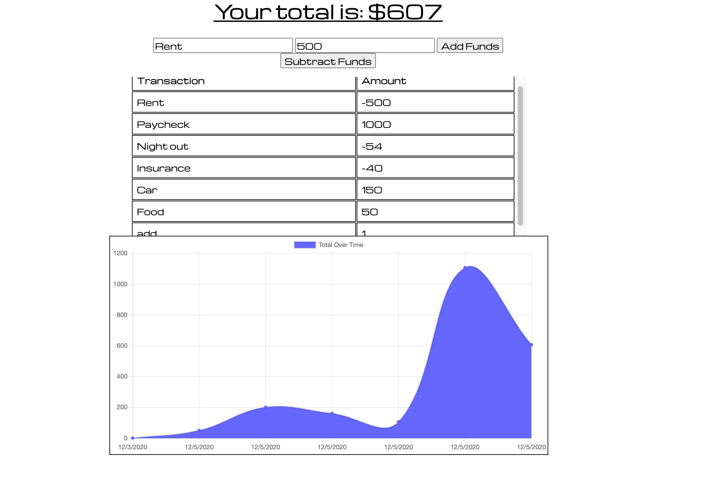

# budget

## Table of Contents

[Overview](#Overview)

[Installation](#Installation)

[Licenses](#Licenses)

[Contributors](#Contributors)

[Questions](#Questions)

[Screenshots](#Screenshots)

### Overview
For this assignment, we are creating a Budget Tracker application that allows offline access and functionality.

The user will be able to add expenses and deposits to their budget with or without a connection. When entering transactions offline, they should populate the total when brought back online.

Offline Functionality:

Enter deposits offline

Enter expenses offline

When brought back online:

Offline entries should be added to tracker.

## Installation
N/A

## Contributors

Jennifer Aguirre

## Links

https://youtu.be/m2B6mj29uZk

https://offline-budgettrack.herokuapp.com/

## Screenshot

